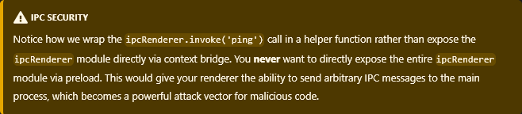

# Learning Electron App

## Descrição
Este é um repositório com o início de uso do framework Electron.
O foco aqui foi compreender como estruturar inicialmente um projeto, quais as necessidades e como organizar tudo.

## Tecnologias
- NodeJS
- NPM
- package Electron
- HTML
- Javascript

## Passo a passo (seguindo a doc)

### Parte 1

#### Estrutura básica do projeto
Crie uma pasta do seu projeto 

```(bash)
mkdir your_folder_name 
cd your_folder_name
```

Inicie um novo projeto Node e configure os dados

```(bash)
npm init
```

Instale a biblioteca electron

```(bash)
npm install electron --save-dev
```

Crie o arquivo main.js ou index.js e adicione (o mesmo que foi configurado na criação do projeto)

```(bash)
console.log('Hello from Electron 👋')
```

Adicione no package.json o script para start com electron.

```(bash)
 "scripts": {
    "start": "electron .",
 }
```

Para iniciar o projeto rode no terminal

```(bash)
npm run start
```

#### Implementando melhorias

- Em cima desse projeto base e seguindo a documentação foi criado um arquivo .HTML
- Foi adicionado o template da página do docs.
- Foi adicionado em main.js o código para criação de uma janela
- Foi adicionado um código de lifecycle da janela

### Parte 2

#### Implementando o preload

- Foi criado o arquivo `preload.js` para expor as funções/processos necessários em 'versões'.
- Foi criado o `renderer.js` para utilizar-se do dom e funções como `getElementById`
- Foi modificado o `createWindow` para chamar o preload
- Foi adicionado o script `renderer.js` e a tag de parágrado com o ido configurado em `index.html`

#### Comunicação entre processos



- Foi adicionada a chamada de invocação com ping do IPC renderer em `preload.js`
- Foi adicionado o IPC Main com handle em `main.js`
- Foi adicionado o ping em `renderer.js`


### Parte 3

#### Implementação de Dark Mode

- Foi limpo os arquivos locais com infos não necessárias
- Foi chamado o `IPC Main` e `nativeTheme` em `main.js` 
- Foi adicionado estilização em `style.css` e adicionado botões em `index.html`
- Foi adicionado no `preload.js` exposição do ipcRenderer para rederizar os dois processos
- Foi adicionado o controle de botões no ``renderer.js`

### Parte 4

#### Implementação o Bluetooth

- Criado arquivo de configuração externo de dark mode em `functions/darkModeToogle.js`
- Criado arquivo de configuração de uso do device bluetooth em `functions/webBluetooth.js`
- Atualizado `preload.js` para expose in main world
- Atualizado `index.html` para adicionar a atualização
- Atualizado o `renderer.js` para uso de Bluetooth